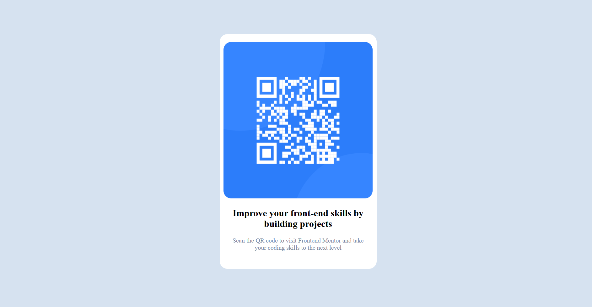

# Frontend Mentor - QR code component solution

This is a solution to the [QR code component challenge on Frontend Mentor](https://www.frontendmentor.io/challenges/qr-code-component-iux_sIO_H). Frontend Mentor challenges help you improve your coding skills by building realistic projects.

## Table of contents

- [Overview](#overview)
  - [Screenshot](#screenshot)
  - [Links](#links)
- [My process](#my-process)
  - [Built with](#built-with)
  - [Useful resources](#useful-resources)
- [Author](#author)

## Overview

It's not that hard project. It is based on Box-Model in which we create the a div then go forward.

### Screenshot

### Links

- Solution URL: [Add solution URL here](https://your-solution-url.com)

## My process

1. creat a div of class-name: card then center that div by giving the margin: 10rem(top/bottom) auto(left/right) and gave the width of 25rem and height 37.5rem and the background-color White: hsl(0, 0%, 100%).
2. Add img and the width and height is 23.75 and 25 respectivly and the margin: 1.25rem 0 0 0.625rem.
3. I gave the marging of 1.875rem to the left and right and align the text in center.

### Built with

- Semantic HTML5 markup
- CSS custom properties

### Useful resources

- [Text align](https://stackoverflow.com/questions/15121343/how-to-center-a-p-element-inside-a-div-container) - This helped me for Text Align. I really liked this pattern and will use it going forward.

## Author

- Linkedin - [Sameer](https://www.linkedin.com/in/sameer-pce/)
- Frontend Mentor - [@ThePlator](https://www.frontendmentor.io/profile/ThePlator)
- GitHub - [@ThePlator](https://github.com/ThePlator)
